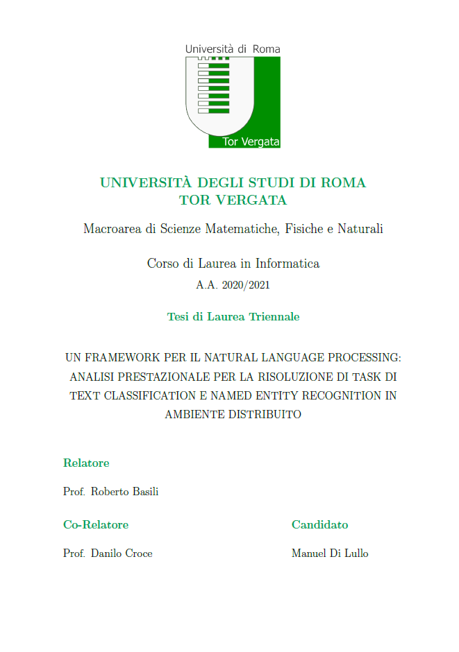

# Bachelor's degree thesis
Thesis written by Manuel Di Lullo for the bachelor's degree in Computer Science at the University of Rome Tor Vergata. The title of the work is: "Un framework per il Natural Language Processing: analisi prestazionale per la risoluzione di task di Text Classification e Named Entity Recognition in ambiente distribuito" and it describe an experimental evaluation of a solution for tasks of Named Entity Recognition and Text Classification using Spark NLP in a distributed environment alongside Apache Hadoop and Apache Spark. The contents are in Italian.  

<p align="center">
    
</p>

## Abstract
Our world is made of words. The use of language is one of the main traits that distinguishes homo sapiens from other species. Our ancestors invented natural language many thousand of years ago for the needs of a developing human society. Chimpanzees, dolphins and other animals have shown words in hundreds of signs but only humans can reliably communicate an unlimited number of different messages on any topic using discreet signs.   

Our daily life is mainly based on our way of communicate with other people. We can do it speaking, writing letters, publishing works, but above all, in this historical period, it is done using the web. Only in 2021: 319.6 bilions of email and 100 of WhatsApp messages are sent, 1.8 bilions of people use Facebook and 1.3 bilions access its instant messaging app Facebook Messenger. All of this generate a massive amount of informations.

Why do we want our IT agents to be able to process natural languages? Mainly to make them communicate with humans and to acquire information from written text. The amount of data that we are collecting globally is growing exponentially. And while it happens the number of analysts is only growing linearly - in other words, we humans simply can't keep up.   

This wealth of unstructered data is so vast that we don't know even what we don't know. Natural Language Processing help us to create structure within this large volumes of data. That means we can now automate the analysis and find information that we didn't even know we were looking for.   

Natural Language Processing (NLP) is a field of Artificial Intelligence (AI) that allow computer to analize and understand the human language, both written and spoken. NLP employs computer algorithms and AI to allow computers to recognize and respond to human communication.   

In order to keep pace with the growth of data, especially in the last years, the need of make systems that deal with their analysis more and more performing is grown. A single system is not enough and often we resort to what is called distributed computing.    

The development of this Thesis aims to study the performance behavior of a distributed system built to solve Natural Language Processing tasks. In particular, we'll deal with Apache Spark framework, a multilingual engine for the execution of data engineering, data science and machine learning on single machine and clusters. Spark takes advantage of the Transfer Learning paradigm that intends to pre-calculate the best model that we can develop and then use this knowledge on other tasks.

## bibTex
```
@bachelorsthesis{ mdl_bachelorsthesis2022,
    autor = "Manuel Di Lullo",
    title = "Un framework per il Natural Language Processing: analisi prestazionale per la risoluzione di task di Text Classification e Named Entity Recognition in ambiente distribuito",
    school = "Università degli Studi di Roma Tor Vergata",
    year = "2022"
}
```